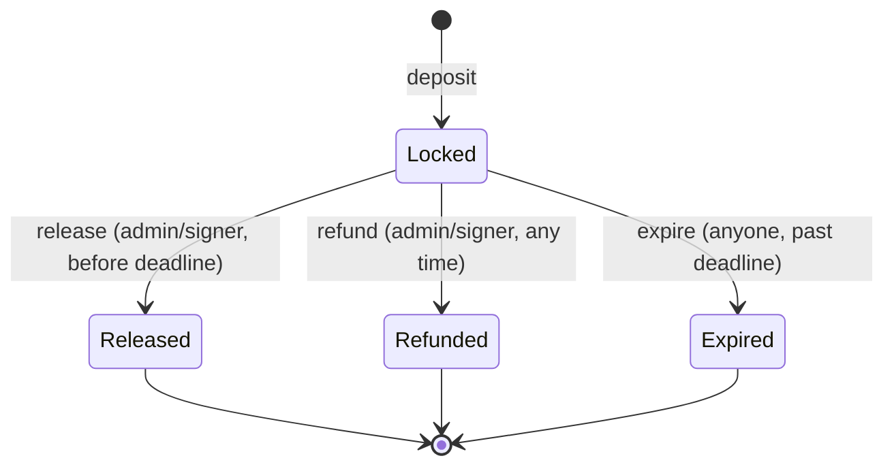

# Contract-level architecture

Per `../Architecture.md` §2.3/§5.2, the escrow contract is the on-chain
counterparty of the StellarRail chain service. This file maps the repo tree
to those responsibilities.

## Module tree

```text
src/
  lib.rs        # #[contract] + entrypoints (thin glue, no business logic)
  types.rs      # EscrowRequest / EscrowStatus / SCHEMA_VERSION
  errors.rs     # EscrowError codes 1..=11
  storage.rs    # DataKey enum + TTL-extending helpers + Stats counters
  events.rs     # FundsLocked / PaymentReleased / PaymentRefunded / RequestExpired
  admin.rs      # initialize / pause / transfer_admin / set_signer / migrate auth
  validation.rs # pure checks: amounts, deadlines, pagination caps
tests/
  happy_path.rs          # three lifecycles (deposit→release/refund/expire)
  integration_sandbox.rs # real WASM in local env + pause + rotation
docs/
  TOOLCHAIN.md  # reproducible pins
  ERRORS.md     # error-code → API mapping
  STORAGE.md    # schema + TTL strategy
  EVENTS.md     # topics + indexer fields
  ...           # (INDEXER, GAS, AUTH_MATRIX, AUDIT_CHECKLIST, ...)
scripts/        # sandbox, deploy, invoke, validation helpers
clients/js/     # TypeScript invocation snippets for the chain service
networks/       # testnet/mainnet RPC + passphrase configs
deployments/    # registry: contract IDs, wasm hashes, smoke evidence
```

## Data flow

```text
depositor --(SAC transfer w/ auth)--> escrow contract --(release)--> destination
                                     \--(refund/expire)--> depositor
```

The contract never mints; it only pulls on `deposit` (via the depositor's
authorization) and pushes on settlement. Status is written **before** the
external token call (checks-effects-interactions).

## Lifecycle



Terminal states never transition; every second mutation fails `InvalidState`
with balances unchanged (`test::edge_double_ops_move_no_funds`).

## Trust boundaries

- `release`/`refund`: admin OR signer (`caller.require_auth()` + role check).
  The caller is an explicit parameter because Soroban `require_auth` can only
  express AND over fixed addresses, not OR (see `docs/adr/003-*.md`).
- `expire`: permissionless (anyone may rescue past-due funds).
- Views (`get_request`, `list_requests`, `get_stats`): no auth, no writes.
