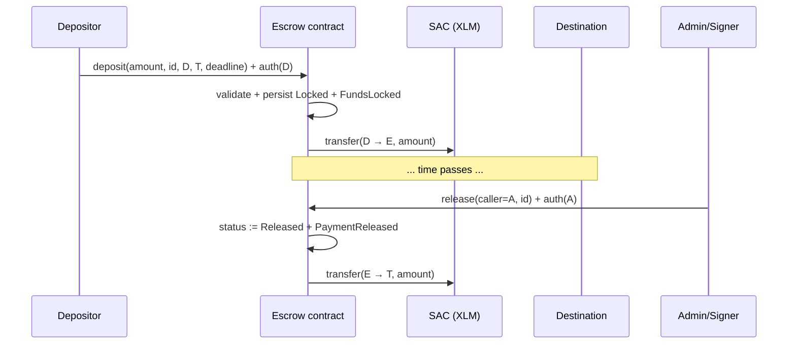

# XLM handling design (v1)

## Decision

**v1 settles native XLM through the Stellar Asset Contract (SAC) token
interface.** The escrow contract stores one `Token` address at `initialize`
and moves funds exclusively via `token::Client::transfer`:

- `deposit`: `transfer(depositor → contract, amount)` — depositor auth required.
- `release`: `transfer(contract → destination, amount)`.
- `refund` / `expire`: `transfer(contract → depositor, amount)`.

No custom assets in v1 (PRD non-goal). Multi-asset support later = one extra
`token` field per request + allowlist; the `token::Client` call sites already
take the token address as a parameter, so the change is additive.

## Alternatives considered

| Option | Verdict |
|---|---|
| Native XLM `transfer` via base operation semantics | Rejected: contracts cannot move native balances directly; the SAC is the only on-chain interface. |
| Per-deposit token parameter | Rejected for v1: doubles storage + validation surface; revisit for multi-asset. |
| Mint/burn wrapper | Rejected: escrow is a pass-through vault, never an issuer. |

## Sequence (deposit → release)



Status is written **before** the external `transfer` (checks-effects-
interactions); the Soroban host additionally forbids reentering the
contract mid-call, so a malicious SAC cannot double-settle.

## SAC contract ids per network

The native-XLM SAC id is deterministic per network. Resolve it at deploy
time — never hardcode:

```bash
# testnet
stellar contract id asset --asset native --network testnet
# -> CDLZFC3SYJYDZT7K67VZ75HPJVWEQ4Q54F66RFAEMSTY6B4YBMJINOX4V (verify output)

# mainnet
stellar contract id asset --asset native --network mainnet
```

Record the verified id in `deployments/<network>.json` (`token` field) and
pass it to `initialize(admin, signer, token)`. Unit tests mint via
`env.register_stellar_asset_contract_v2(admin)` (see ISSUE-013).
